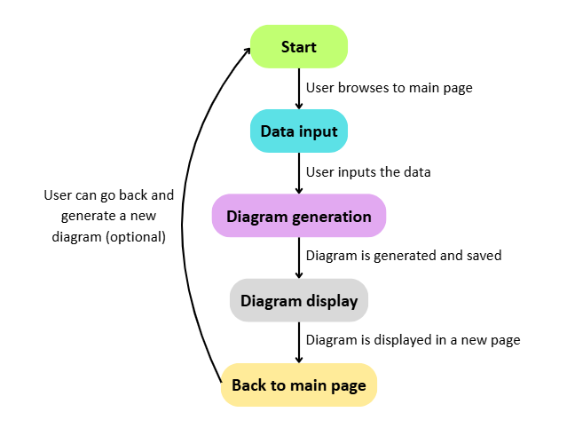

# Design

This chapter illustrates the architectural, modelling, interactional, behavioural, and data-related strategies adopted to implement the system described in the analysis. The objective is to clarify how the software’s structure and behaviour derive from the identified requirements and how the chosen design solves the domain problems.

## Architecture
The implemented system follows a three-layered web application architecture, aligned with a classical Model–View–Controller (MVC) pattern:

### 1. Presentation layer:
- Implemented through HTML templates.
- Responsible for rendering views, presenting forms to the user, and displaying results.
  
### 2. Application layer:
- Defines the Flask application.
- Manages routing, orchestrates input processing, and coordinates the interaction between the presentation and domain layers.
  
### 3. Domain layer:
- Business logic functions modelling the investment-risk evaluation domain.
- Responsible for applying decision rules, computing outputs, and enforcing domain invariants.
  
## Technologies
### Front-end:
For what concerns the front end, Heplinvest was built using the main web application technologies: HTML and CSS. HTML defines the structure and organization of a webpage, while CSS controls its visual appearance and layout. The front end is composed by two pages: a homepage where the User can input the data and access relevant information, and a second page, where the resulting diagram is displayed. 
### Back-end:
Considering the back-end, the main technology used was Python, in particualr Flask, a lightweight web framework for Python that allows users to build web applications and APIs. This decision was taken because of the simple nature of the project, which did not require any more complex technologies. Additional Python libraries, such as Numpy and Matplotlib were used in order to create the diagrams to be displayed.

## Domain Driven Design
### Domain
The domain of Helpinvest is fairly simple, focussing on the amount of money the users would like to invenst, and the level of risk (and related volatily) they are willing to take. The possible users of the application can range from people who want to invest on their own and professionals who want to quickly visualise the behaviour of their investment portfolio.

### Core entitites
Even though the implementation uses functions instead of classes, the conceptual model can be expressed through domain classes to illustrate the design.
#### User
- Represents the user's input data
- Ensures the presence and basic correctness of attributes
#### RiskAssesment
- Ecapsulates the evaluation rules
- Input: User
- Output: AssessmentResult
#### AssesmentResult 
- Contains the derived risk classification

### Commands
The only actual command is related to the creation of the diagram that will then be displayed. When the command is triggered, a specific function (based on the level of risk chosen) runs, generating the diagram using the amounts gathered from the user's input.

## Interaction
### User inputs data
While browsing the homepage of Helpinvest, the user can input the data they want to create their diagram. They need to input numerical data for the first three fields and select a pre-determined value for the last one. Then they can click on "Go" to generate their diagram.
### Diagram is generated and displayed
Once the values are entered, they are sent to the application layer, where the business logic is applied and the diagram is generated, using the Matplotlib library. The graph will be saved in a local folder (static>images) as a .png image, for easy access from the presentation layer. Then, a new page is loaded for the user, which will access the "images" folder and display the .png image saveed inside. Once in this page, the user also has the possibility to redirect to the main page in order to generate a new diagram, which will be saved over the old one in the "images" folder.

## Behaviour
The flowchart below shows what are the activities performed when using the application.
- User inputs data
- Data is sent to the Application Layer
- Diagram is generated
- Diagram is saved
- A new page is loaded, displaying the diagram
- User can go back to main page to generate a new one

  
  
  
## Data-related aspects
The application is designed to be stateless and therefore it does not use any persistence technologies, such as SQL or NoSQL databases.
### Data handling
- User input values are sent via an HTTP POST request and exist in memory only for the duration of the request.
- No data is stored, logged, or persisted.
- Only validated data is passed to domain logic functions.
